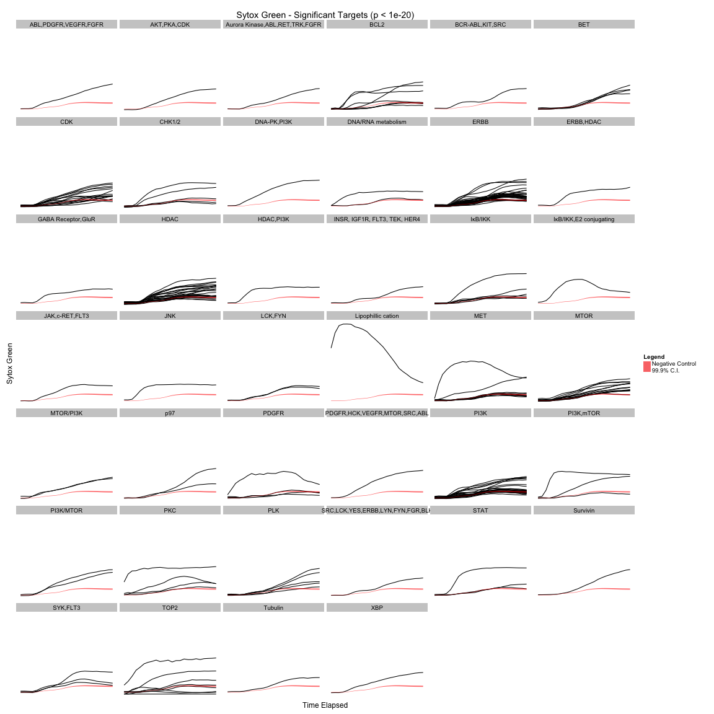
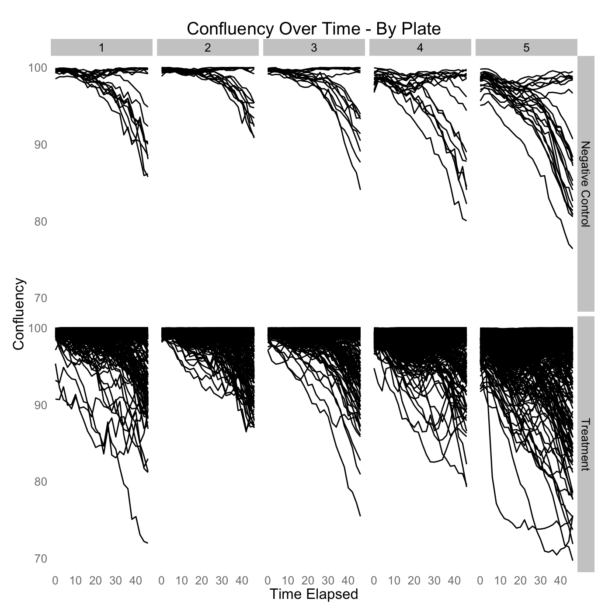
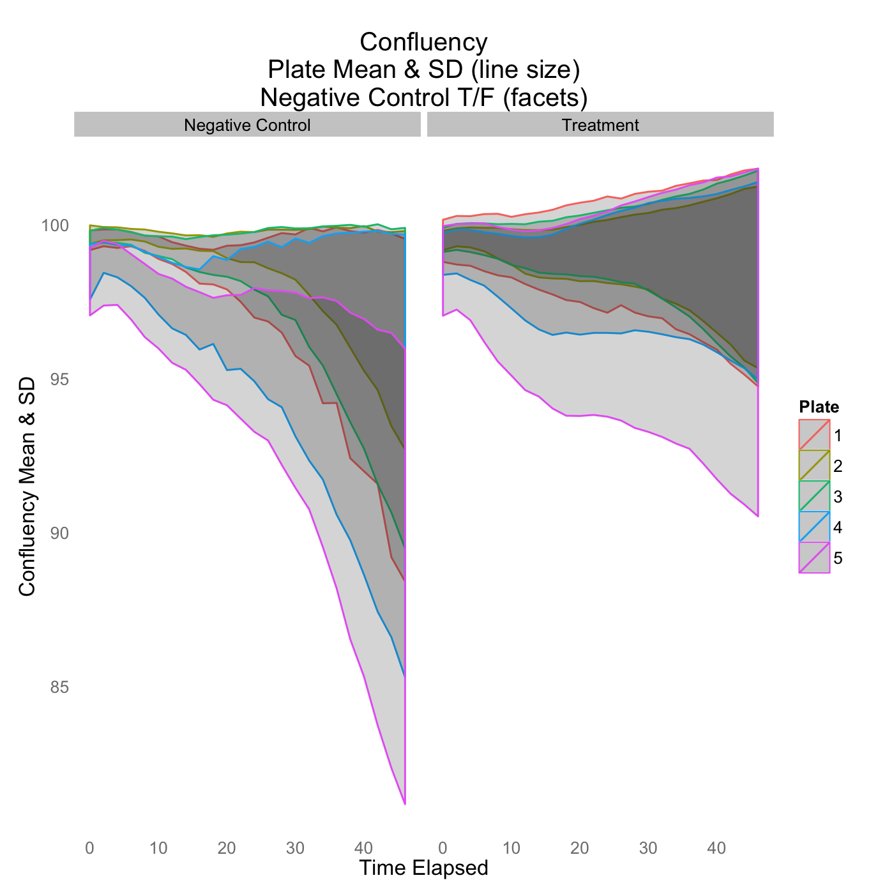

Quality Control
=============

Note: To get the hover information working correctly on Plotly graphs (the interactive graphs), do the following: 
1. Hover anywhere over graph
2. You'll see icons appear at the top right-hand corner of the graph
3. Select the icon for "Show closest data on hover"

Compare controls and treatments
-----------------------------------------------

```
## Estimated Draw Time SlowThe draw time for this plot will be slow for clients without much RAM.
```

<iframe height="600" id="igraph" scrolling="no" seamless="seamless"
				src="https://plot.ly/~mas29/225" width="600" frameBorder="0"></iframe>


```
## Estimated Draw Time SlowThe draw time for this plot will be slow for clients without much RAM.
```

<iframe height="600" id="igraph" scrolling="no" seamless="seamless"
				src="https://plot.ly/~mas29/223" width="600" frameBorder="0"></iframe>


Compare plates for controls and treatments
-----------------------------------------------



Compare sparklines for each plate, controls vs treatments, with mean and sd for each plate and control/treatment
-----------------------------------------------



