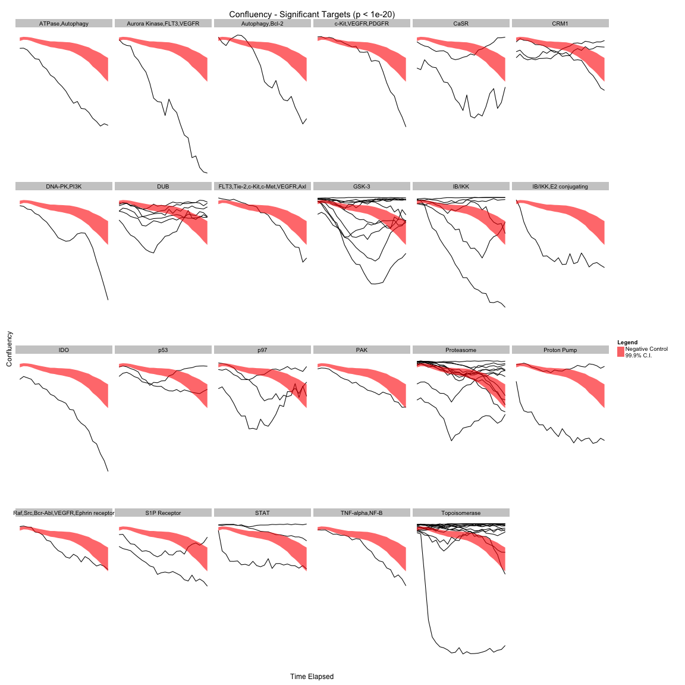

Target Analysis
===========

Which targets are significantly different from the negative controls (measured by AUC)?
------------------------


For Sytox Green:


```
## [1] "The following targets have an AUC for Sytox Green significantly different (p < 1e-20) from the negative controls' AUC?"
```

```
##  [1] "ABL,PDGFR,VEGFR,FGFR"             "AKT,PKA,CDK"                     
##  [3] "Aurora Kinase,ABL,RET,TRK,FGFR"   "BCL2"                            
##  [5] "BCR-ABL,KIT,SRC"                  "BET"                             
##  [7] "CDK"                              "CHK1/2"                          
##  [9] "DNA-PK,PI3K"                      "DNA/RNA metabolism"              
## [11] "ERBB"                             "ERBB,HDAC"                       
## [13] "GABA Receptor,GluR"               "HDAC"                            
## [15] "HDAC,PI3K"                        "INSR, IGF1R, FLT3, TEK, HER4"    
## [17] "IκB/IKK"                          "IκB/IKK,E2 conjugating"          
## [19] "JAK,c-RET,FLT3"                   "JNK"                             
## [21] "LCK,FYN"                          "Lipophillic cation"              
## [23] "MET"                              "MTOR"                            
## [25] "MTOR/PI3K"                        "p97"                             
## [27] "PDGFR"                            "PDGFR,HCK,VEGFR,MTOR,SRC,ABL"    
## [29] "PI3K"                             "PI3K,mTOR"                       
## [31] "PI3K/MTOR"                        "PKC"                             
## [33] "PLK"                              "SRC,LCK,YES,ERBB,LYN,FYN,FGR,BLK"
## [35] "STAT"                             "Survivin"                        
## [37] "SYK,FLT3"                         "TOP2"                            
## [39] "Tubulin"                          "XBP"
```

Sytox Green sparklines for the significant targets:

 

For Confluency:


```
## [1] "The following targets have an AUC for Confluency significantly different (p < 1e-20) from the negative controls' AUC?"
```

```
##  [1] "AKT,ERK,Other"                     
##  [2] "ATM,ATR"                           
##  [3] "CASR"                              
##  [4] "CHK1/2"                            
##  [5] "CYP19A1 (Estrogen synthetase)"     
##  [6] "DNA/RNA Metabolism"                
##  [7] "Dopamine Receptor, Calcium Channel"
##  [8] "FLT3,RET,Aurora Kinase"            
##  [9] "GBF1"                              
## [10] "HDAC"                              
## [11] "HMGCR"                             
## [12] "IDO"                               
## [13] "IκB/IKK,E2 conjugating"            
## [14] "JAK"                               
## [15] "MTOR"                              
## [16] "O-GlcNAcase"                       
## [17] "p97"                               
## [18] "PDGFR"                             
## [19] "PI3K"                              
## [20] "Retinoic Acid Receoptor"           
## [21] "ROCK"                              
## [22] "S1P Receptor"                      
## [23] "SRPK"
```

Confluency sparklines for the significant targets:

 
