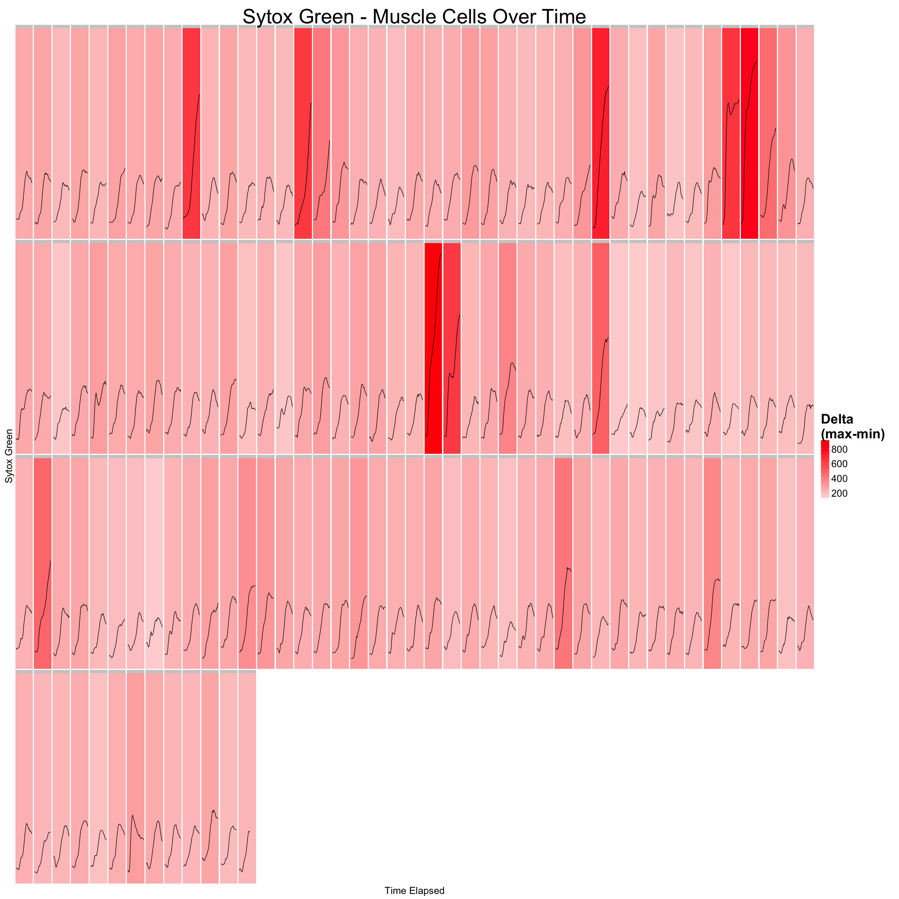

# Getting Bricks Plot to Work!
Maia Smith  
March 5, 2015  


```
## Warning: package 'knitr' was built under R version 3.1.2
```

```
## Warning: package 'devtools' was built under R version 3.1.2
```

```
## Warning: package 'car' was built under R version 3.1.2
```

```
## Loading required package: RCurl
```

```
## Warning: package 'RCurl' was built under R version 3.1.2
```

```
## Loading required package: bitops
## Loading required package: RJSONIO
```

```
## Warning: package 'reshape2' was built under R version 3.1.2
```

```
## Warning: package 'gplots' was built under R version 3.1.2
```

```
## 
## Attaching package: 'gplots'
## 
## The following object is masked from 'package:stats':
## 
##     lowess
```

```
## Warning: package 'RColorBrewer' was built under R version 3.1.2
```


```r
opts_chunk$set(comment=NA, fig.width=26, fig.height=26)
```

 
