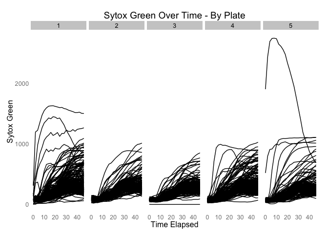
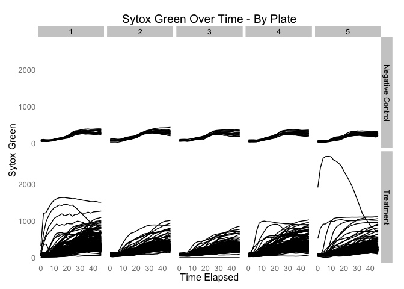
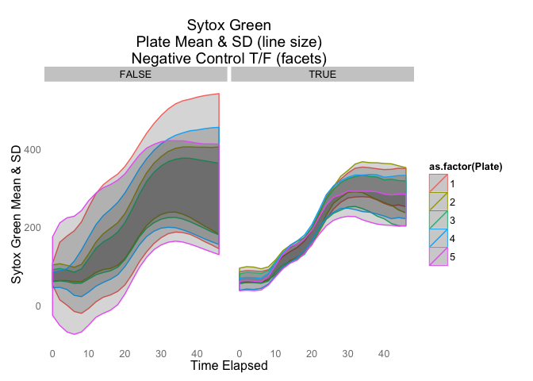

# Visualization and Analysis of IncuCyte Output
Maia Smith  
February 9, 2015  


```r
library(ggplot2)
library(grid)
library(plyr)
library(knitr)
```

```
## Warning: package 'knitr' was built under R version 3.1.2
```

```r
library(devtools)
```

```
## Warning: package 'devtools' was built under R version 3.1.2
```

```r
load(file="/Users/maiasmith/Documents/SFU/ClarkeLab/ClarkeLab_github/DataObjects/sytoxG_data.R")
```
Quality Control
=============

Compare plates for all data (controls and treatments)
-----------------------------------------------

 

Compare controls and treatments
-----------------------------------------------

 

Compare sparklines for each plate, controls vs treatments, with mean and sd for each plate and control/treatment
-----------------------------------------------

 


<center><iframe scrolling='no' seamless='seamless' style='border:none' src='https://plot.ly/~mas29/100/delta-max-min-vs-pathway.embed?width=550&height=550/800/1200' width='800' height='1200'></iframe><center>


<center><iframe scrolling='no' seamless='seamless' style='border:none' src='https://plot.ly/~mas29/81/sytox-green-muscle-cells-over-time.embed?width=550&height=550/800/1200' width='800' height='1200'></iframe><center>
