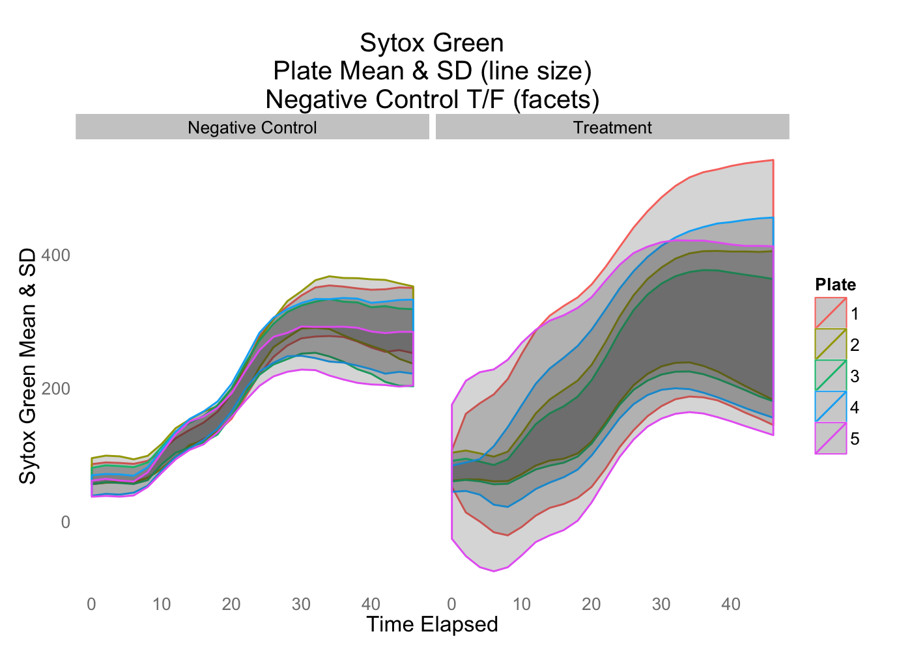

# Visualization and Analysis of IncuCyte Output
Maia Smith  
February 9, 2015  


```
## Warning: package 'knitr' was built under R version 3.1.2
```

```
## Warning: package 'devtools' was built under R version 3.1.2
```

```
## Warning: package 'car' was built under R version 3.1.2
```

```
## Loading required package: RCurl
```

```
## Warning: package 'RCurl' was built under R version 3.1.2
```

```
## Loading required package: bitops
## Loading required package: RJSONIO
```

```
## Warning: package 'reshape2' was built under R version 3.1.2
```
Quality Control
=============

Compare controls and treatments
-----------------------------------------------


<center><iframe scrolling='no' seamless='seamless' style='border:none' src='https://plot.ly/~mas29/225/sytox-green-over-time-control-vs-treatment.embed?width=550&height=550/800/1200' width='800' height='800'></iframe><center>


```r
plot <- ggplot(confluency_data, aes(x=as.numeric(time_elapsed), y=as.numeric(phenotype_value), text=Compound, group=Compound)) +
  geom_line() +
  xlab("Time Elapsed") +
  ylab("Confluency") +
  ggtitle("Confluency Over Time - Control vs Treatment") +
  facet_grid(~empty, scales = "fixed") +
  theme(panel.grid = element_blank(),
        axis.ticks.length = unit(0, "cm"),
        panel.background = element_rect(fill = "white"), 
        axis.text = element_blank())
response <- py$ggplotly(plot, kwargs=list(world_readable=FALSE, filename="Con_control_vs_treatment", fileopt="overwrite"))
url <- response$response$url
```


<center><iframe scrolling='no' seamless='seamless' style='border:none' src='https://plot.ly/~mas29/223/confluency-over-time-control-vs-treatment.embed?width=550&height=550/800/1200' width='800' height='800'></iframe><center>

Compare plates for controls and treatments
-----------------------------------------------

  

Compare sparklines for each plate, controls vs treatments, with mean and sd for each plate and control/treatment
-----------------------------------------------

  

Individual sparklines for each compound
-----------------------------------------------


Pathway analysis 
================

Sparklines by Pathway
------------------------


<center><iframe scrolling='no' seamless='seamless' style='border:none' src='https://plot.ly/~mas29/227/sytox-green-facets-pathway.embed?width=550&height=550/800/1200' width='800' height='800'></iframe><center>


<center><iframe scrolling='no' seamless='seamless' style='border:none' src='https://plot.ly/~mas29/230/confluency-facets-pathway.embed?width=550&height=550/800/1200' width='800' height='800'></iframe><center>

Delta (max-min) values by Pathway
----------------------------------


<center><iframe scrolling='no' seamless='seamless' style='border:none' src='https://plot.ly/~mas29/233.embed?width=550&height=550/800/1200' width='800' height='800'></iframe><center>


<center><iframe scrolling='no' seamless='seamless' style='border:none' src='https://plot.ly/~mas29/235.embed?width=550&height=550/800/1200' width='800' height='800'></iframe><center>

Statistical Analyses
===================

Normal Q-Q Plots
--------------


At what time point do we see the first significant differences in phenotypic marker values? 
------------------
In Sytox Green?


```
## 
## Call:
## lm(formula = phenotype_value ~ time_elapsed, data = data_for_stats, 
##     subset = phenotypic_Marker == "SG")
## 
## Residuals:
##     Min      1Q  Median      3Q     Max 
## -314.46  -38.23  -14.59    8.44 2669.95 
## 
## Coefficients:
##                Estimate Std. Error t value Pr(>|t|)    
## (Intercept)      74.528      2.483  30.016  < 2e-16 ***
## time_elapsed2     4.108      3.511   1.170  0.24207    
## time_elapsed4     2.834      3.511   0.807  0.41970    
## time_elapsed6     1.119      3.511   0.319  0.74997    
## time_elapsed8     9.289      3.511   2.645  0.00816 ** 
## time_elapsed10   30.571      3.511   8.706  < 2e-16 ***
## time_elapsed12   52.287      3.511  14.891  < 2e-16 ***
## time_elapsed14   66.403      3.511  18.911  < 2e-16 ***
## time_elapsed16   75.650      3.511  21.544  < 2e-16 ***
## time_elapsed18   87.923      3.511  25.039  < 2e-16 ***
## time_elapsed20  109.096      3.511  31.069  < 2e-16 ***
## time_elapsed22  138.903      3.511  39.557  < 2e-16 ***
## time_elapsed24  170.426      3.511  48.535  < 2e-16 ***
## time_elapsed26  196.007      3.511  55.820  < 2e-16 ***
## time_elapsed28  214.572      3.511  61.107  < 2e-16 ***
## time_elapsed30  227.747      3.511  64.859  < 2e-16 ***
## time_elapsed32  236.130      3.511  67.246  < 2e-16 ***
## time_elapsed34  240.114      3.511  68.380  < 2e-16 ***
## time_elapsed36  240.164      3.511  68.395  < 2e-16 ***
## time_elapsed38  237.577      3.511  67.658  < 2e-16 ***
## time_elapsed40  233.288      3.511  66.436  < 2e-16 ***
## time_elapsed42  229.036      3.511  65.226  < 2e-16 ***
## time_elapsed44  225.055      3.511  64.092  < 2e-16 ***
## time_elapsed46  221.107      3.511  62.968  < 2e-16 ***
## ---
## Signif. codes:  0 '***' 0.001 '**' 0.01 '*' 0.05 '.' 0.1 ' ' 1
## 
## Residual standard error: 108.8 on 46056 degrees of freedom
## Multiple R-squared:  0.4277,	Adjusted R-squared:  0.4274 
## F-statistic:  1497 on 23 and 46056 DF,  p-value: < 2.2e-16
```

```
## [1] "The first significant time point for Sytox Green after the hour 0 is hour 8."
```

In Confluency?


```
## 
## Call:
## lm(formula = phenotype_value ~ time_elapsed, data = data_for_stats, 
##     subset = phenotypic_Marker == "Con")
## 
## Residuals:
##      Min       1Q   Median       3Q      Max 
## -27.9372  -0.2166   0.6207   1.2699   2.3732 
## 
## Coefficients:
##                Estimate Std. Error  t value Pr(>|t|)    
## (Intercept)    99.20075    0.05590 1774.520  < 2e-16 ***
## time_elapsed2   0.08931    0.07906    1.130 0.258628    
## time_elapsed4   0.02492    0.07906    0.315 0.752606    
## time_elapsed6  -0.10445    0.07906   -1.321 0.186459    
## time_elapsed8  -0.27530    0.07906   -3.482 0.000498 ***
## time_elapsed10 -0.43711    0.07906   -5.529 3.24e-08 ***
## time_elapsed12 -0.59151    0.07906   -7.482 7.46e-14 ***
## time_elapsed14 -0.67342    0.07906   -8.518  < 2e-16 ***
## time_elapsed16 -0.73024    0.07906   -9.237  < 2e-16 ***
## time_elapsed18 -0.70453    0.07906   -8.911  < 2e-16 ***
## time_elapsed20 -0.68427    0.07906   -8.655  < 2e-16 ***
## time_elapsed22 -0.65260    0.07906   -8.255  < 2e-16 ***
## time_elapsed24 -0.63643    0.07906   -8.050 8.47e-16 ***
## time_elapsed26 -0.60346    0.07906   -7.633 2.34e-14 ***
## time_elapsed28 -0.61336    0.07906   -7.758 8.78e-15 ***
## time_elapsed30 -0.63689    0.07906   -8.056 8.08e-16 ***
## time_elapsed32 -0.68883    0.07906   -8.713  < 2e-16 ***
## time_elapsed34 -0.76726    0.07906   -9.705  < 2e-16 ***
## time_elapsed36 -0.83190    0.07906  -10.523  < 2e-16 ***
## time_elapsed38 -0.97516    0.07906  -12.335  < 2e-16 ***
## time_elapsed40 -1.11853    0.07906  -14.148  < 2e-16 ***
## time_elapsed42 -1.27866    0.07906  -16.174  < 2e-16 ***
## time_elapsed44 -1.42124    0.07906  -17.977  < 2e-16 ***
## time_elapsed46 -1.57391    0.07906  -19.908  < 2e-16 ***
## ---
## Signif. codes:  0 '***' 0.001 '**' 0.01 '*' 0.05 '.' 0.1 ' ' 1
## 
## Residual standard error: 2.45 on 46056 degrees of freedom
## Multiple R-squared:  0.02796,	Adjusted R-squared:  0.02748 
## F-statistic:  57.6 on 23 and 46056 DF,  p-value: < 2.2e-16
```

```
## [1] "The first significant time point for Confluency after the hour 0 is hour 8."
```
